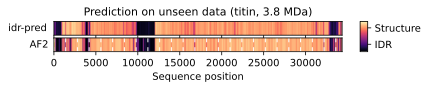

# idr-pred
Minimalist deep learning model for ultra-fast prediction of intrinsic disorder and structured clusters in proteins. Trained as a student model of [AlphaFold2](https://www.nature.com/articles/s41586-021-03819-2).

